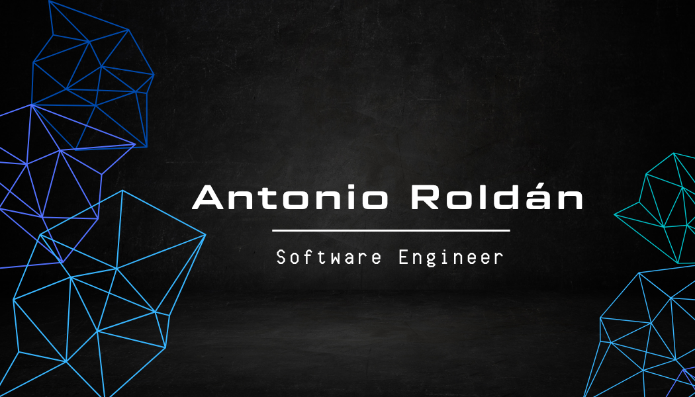

   

<h3 align="center">
  Hi, I'm Antonio Roldán
  
</h3>

  

    

---

- 👨‍💻 Cursando 4º de Ingeniería del Software en la Universidad de Sevilla.
- 💬 Puedes contactar conmigo a través de: antoniorolpe@gmail.com
- 🌱 Mis campos favoritos de la informática son la Inteligencia Artificial, la Ciberseguridad y el Análisis de Datos.
- 🎮 Apasionado de los videojuegos y la tecnología.

## 🛠 &nbsp;Tech Stack

#### 🔧 Languages

#### 🖥️ Frameworks

#### 📚 Libraries

#### 🔧 Tools

